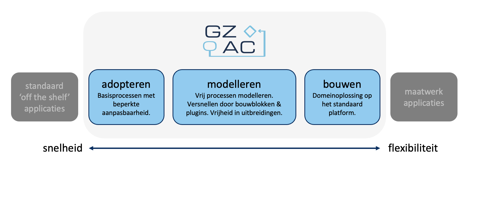

# Adopteren vs bouwen

GZAC staat voor 'generiek zaakafhandelcomponent' - bruikbaar voor verschillende soorten processen, onafhankelijk van een specifiek domein. De afhandeling van zaken wordt gestuurd door processen gemodelleerd in [BPMN](https://www.bpmn.org/) 2.0. &#x20;

#### Wanneer GZAC inzetten?

GZAC bevindt zich tussen de standaard 'commercial off the shelf' applicatie aan de ene kant en en de maatwerk applicatie aan de andere kant. &#x20;

<figure><figcaption></figcaption></figure>

Het platform biedt drie mogelijkheden.&#x20;

Het **adopteren** van basisprocessen levert snel resultaat. Door gebruik te maken van een zaakafhandelproces dat door andere gebruikers is gedeeld wordt snel resultaat behaald. Locale aanpassingen zijn altijd nodig: om te passen op de locale infrastructuur, de eigen rollen en gebruikers, huisstijl, ZGW datalaag en omliggende diensten. Het aantal [basisprocessen ](https://github.com/generiekzaakafhandelcomponent/Basisprocessen/tree/main/blueprints)is nog beperkt.&#x20;

Het vrij **modelleren** van zaakafhandelprocessen in BPMN biedt grote vrijheid. Via configuratie in BPMN (proces), DMN (besluit), Formio (formulieren), JSON (objecten) en instellingen via de UI (plugins, zaaktypes) kunnen complexe processen worden gebouwd in een korte doorlooptijd. Dit wordt aangevuld met code in frontend en backend voor wensen die niet met configuratie in te vullen zijn, zoals unit testing, het koppelen van events in processen, systeemkoppelingen en  wensen die niet met configuratie kunnen worden ingevuld. Er is een [CI/CD-pipeline](https://en.wikipedia.org/wiki/CI/CD) nodig. &#x20;

Het platform kan tot slot ook worden ingezet voor het **bouwen** van domeinspecifieke oplossingen. Daar waar voorheen maatwerkapplicaties werden gebouwd, wordt nu een snelle start gemaakt door gebruik te maken van het GZAC fundament en de beschikbare plugins en bouwstenen. \
\
De overgang tussen adopteren, modelleren en bouwen verloopt gradueel. De keuze heeft invloed op de flexibiliteit, snelheid in oplevering, complexiteit van DevOps, beheer, implementatie- en onderhoudskosten.&#x20;
