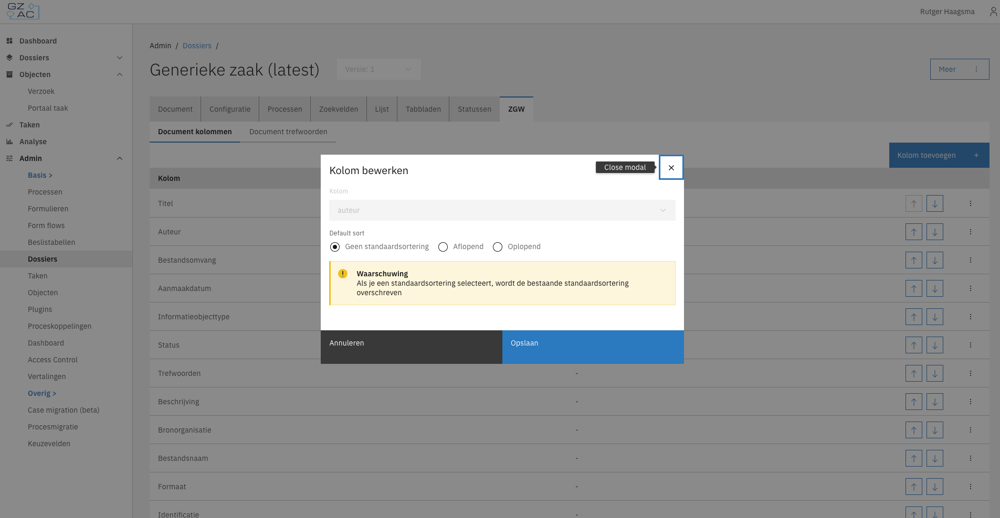

# Product of ontwikkelframework

GZAC Valtimo kan als Product en als Ontwikkelframework worden gebruikt. Het doel zal in veel gevallen gelijk zijn: het automatiseren van bedrijfsprocessen. De keuze voor één van beide opties heeft gevolgen voor de bemensing van je team en de mogelijkheden die je hebt.

### Compileren: de grens tussen gebruik als Product en Ontwikkelframework 

Het grote voordeel van het gebruik van GZAC Valtimo als ontwikkelframework is dat alle mogelijkheden die het Kotlin/Java-ecosysteem en Angular bieden, tot je beschikking staan. Deze programmeertalen vereisen _compileren_. Deze aanpak vereist ervaring met programmeren, branching, versiebeheer enzovoorts. Je hebt een CI/CD-pipeline nodig om de code te builden (compileren) en te deployen.

Bij het gebruik van GZAC Valtimo als Product is geen compileren nodig: het resultaat van aanpassingen is direct zichtbaar. Een bedrijfsproces wordt gedefinieerd in de vorm van JSON, XML en Javascript. Dit kan via de builder worden gedaan of via een ontwikkelomgeving (IDE). Een CI/CD-pipeline is aan te raden, maar geen noodzaak.\
Note: het _deployen_ van processen (packages) via een centrale repository wordt in de toekomst verwacht.

Er zijn in feite drie opties voor het gebruik/toepassen van Valtimo. De voor- en nadelen worden hieronder toegelicht.

* [Het bouwen van een bedrijfsproces in het Product, via de Builder](https://ritense.atlassian.net/wiki/spaces/RIT/pages/1422229511/Het+bouwen+van+processen#Het-bouwen-van-een-bedrijfsproces-in-het-Product%2C-via-de-Builder)
* [Het bouwen van een bedrijfsproces in het Product, via de ontwikkelomgeving](https://ritense.atlassian.net/wiki/spaces/RIT/pages/1422229511/Het+bouwen+van+processen#Het-bouwen-van-een-bedrijfsproces-in-het-Product%2C-via-de-ontwikkelomgeving)
* [Het bouwen van een bedrijfsproces in Valtimo als Ontwikkelframework](https://ritense.atlassian.net/wiki/spaces/RIT/pages/1422229511/Het+bouwen+van+processen#Het-bouwen-van-een-bedrijfsproces-in-Valtimo-als-Ontwikkelframework)

#### Het bouwen van een bedrijfsproces in het Product, via de Builder 

In plaats van geprogrammeerd worden processen in GZAC Valtimo geconfigureerd. Processen met BPMN, beslismodellen in DMN en formulieren worden via ‘drag & drop’ interfaces opgebouwd. In andere gevallen worden configuraties direct in JSON-files geschreven, zoals de rollen en rechten. In al deze gevallen wordt het resultaat vastgelegd in JSON of XML.

Is er behoefte aan business logica, dan kan er gebruik worden gemaakt van javascript en DMN.

De typische rollen die deze werkzaamheden uitvoeren zijn de business process engineer of een technisch process consultant. Mensen met een goed gevoel voor webtechnologie, ervaring met scripting of beperkte programmeerervaring en in staat om complexe uitdagingen aan te gaan.

<figure><figcaption>
De bouwen van een bedrijfsproces via de Builder.
</figcaption></figure>

**Het bouwen van een bedrijfsproces in het Product, via de ontwikkelomgeving**

Het bouwen van bedrijfsprocessen via de Builder is de meest toegankelijke manier om processen te bouwen. Echter is het ook de meest beperkende: niet alle functionaliteit die beschikbaar is in het product, is te configureren of modelleren via de Builder. Er zijn meer mogelijkheden door met een ontwikkelomgeving - een IDE, Integrated Development Environment - te werken. De meest belangrijke:

1. Alle configuratiefiles worden opgeslagen in een versioningsysteem, meestal Git. Er is exact vastgelegd welke aanpassing door wie is gedaan - soms nodig voor compliancy.
2. Er kunnen meerdere mensen werken aan het bouwen van één bedrijfsproces, en zelfs aan één file. Dit voegt waarde toe bij de bouw van omvangrijke bedrijfsprocessen.
3. Het werken met een IDE is voor ervaren business process engineers over het algemeen sneller.

#### Het bouwen van een taakappplicatie op basis van GZAC Valtimo als Ontwikkelframework 

Als GZAC Valtimo als ontwikkelframework wordt gebruikt, gelden alle voor- en nadelen zoals hierboven benoemd. Er komt echter één groot voordeel bij: de mogelijkheid om te programmeren. Dat betekent dat er onbeperkt mogelijkheden ontstaan om de frontend (user interface) en de backend uit te breiden of aan te passen. Er zijn organisaties die een compleet eigen frontend bouwen op de Valtimo backend, of een domeinspecifieke toepassing bouwen op basis van het standaard product.

Nadelen zijn er ook:

* Hoe meer code, hoe meer last van breaking changes. Het upgraden van Valtimo wordt lastiger en duurder, terwijl dit wel van groot belang is voor de veiligheid en stabiliteit van het platform.
* Er is meer kunde nodig van ontwikkelaars.
* Het resultaat is moeilijker deelbaar met anderen, voor hergebruik. Een basisproces zonder code kan eenvoudig worden geexporteerd en worden aangeboden aan andere organisaties, een repo met code is lastiger en vaak specifieker voor een bepaalde use case.
