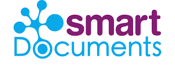

# Plugins

Met plugins kan extra functionaliteit aan GZAC worden toegevoegd. GZAC wordt standaard geleverd met een selectie van plugins. Je kunt er zelf naar behoeven extra aan toevoegen. Plugins worden vaak gebruikt voor het (generiek) leggen van koppelingen met andere systemen.&#x20;

<table data-view="cards"><thead><tr><th></th><th></th><th></th><th data-hidden data-card-cover data-type="files"></th><th data-hidden data-card-target data-type="content-ref"></th></tr></thead><tbody><tr><td></td><td><a href="https://docs.valtimo.nl/using-valtimo/plugins/configure-openzaak-plugin">De OpenZaak Plugin</a> biedt authentication voor andere ZGW (Zaakgericht Werken) plugins die gegevens willen uitwisselen met de Maykin OpenZaak implementatie. </td><td></td><td><a href="../.gitbook/assets/52713039.png">52713039.png</a></td><td></td></tr><tr><td></td><td>De <a href="https://docs.valtimo.nl/using-valtimo/plugins/configure-zaken-api-plugin">Zaken API Plugin</a> biedt ondersteuning voor het opslaan en inzien van Zaakgegevens. Kan worden gebruikt met elke applicatie die de VNG standaard ondersteunt. </td><td></td><td><a href="../.gitbook/assets/vng_logo_300 (1).png">vng_logo_300 (1).png</a></td><td></td></tr><tr><td></td><td>Overige Objecten Registratie ('<a href="https://docs.valtimo.nl/using-valtimo/plugins/configure-objecten-api-plugin">Objects API') Plugin</a>. Voor het wegschrijven en ophalen van Objecten. </td><td></td><td><a href="../.gitbook/assets/objectenapi_logo.png">objectenapi_logo.png</a></td><td></td></tr><tr><td></td><td>

Plugin voor <a href="https://docs.valtimo.nl/using-valtimo/plugins/configure-smartdocuments-plugin">SmartDocuments</a> document generator, om vanuit een BPMN service task documenten te laten genereren.
</td><td></td><td></td><td></td></tr><tr><td>De <a href="https://docs.valtimo.nl/using-valtimo/plugins/configure-exact-plugin">Exact Plugin</a> voor het leggen van een connectie met Exact Online. Ondersteunt GET, POST en PUT requests. </td><td></td><td></td><td><a href="../.gitbook/assets/download-1.png">download-1.png</a></td><td></td></tr><tr><td>De <a href="https://docs.valtimo.nl/using-valtimo/plugins/configure-documenten-api-plugin">Documenten API</a> Plugin biedt het opslaan van documenten en meta-data in elke applicatie die ondersteuning heeft voor de VNG Documenten API specificatie. </td><td></td><td></td><td><a href="../.gitbook/assets/vng_logo_300 (1).png">vng_logo_300 (1).png</a></td><td></td></tr><tr><td>De <a href="https://docs.valtimo.nl/using-valtimo/plugins/configure-portaaltaak-plugin">Portaaltaak</a> Plugin maakt het mogelijk om taken via een portaal aan klant- of ketenpartners aan te bieden. Compatible met NL Portal en alle portalen het takenpatroon ondersteunen. </td><td></td><td></td><td><a href="../.gitbook/assets/vng_logo_300 (1).png">vng_logo_300 (1).png</a></td><td></td></tr><tr><td>De <a href="https://github.com/generiekzaakafhandelcomponent/Plugins/tree/main/slack">Slack Plugin</a> maakt het mogelijk om vanuit een proces berichten op een Slack channel te plaatsen. </td><td></td><td></td><td><a href="../.gitbook/assets/download (1).png">download (1).png</a></td><td></td></tr><tr><td>De <a href="https://github.com/valtimo-platform/valtimo-documentation/blob/main/using-valtimo/plugin/catalogi-api/configure-catalogi-api-plugin.md">Catalogi API Plugin</a> kan worden gebruikt om toegang te krijgen tot data die is opgeslagen in een ZGW catalogus. De plugin is gebaseerd op de standaard van de Nederlandse overheid.</td><td></td><td></td><td><a href="../.gitbook/assets/vng_logo_300 (1).png">vng_logo_300 (1).png</a></td><td></td></tr><tr><td>The <a href="https://docs.valtimo.nl/using-valtimo/plugins/configure-object-token-authentication-plugin">Object Token Authentication Plugin </a>wordt gebruikt om authenticatie te verzorgen voor ZGW (Zaakgericht Werken) plugins zoals de Objecten API.</td><td></td><td></td><td><a href="../.gitbook/assets/GZAC_Logo_2.jpg">GZAC_Logo_2.jpg</a></td><td></td></tr><tr><td><a href="https://docs.valtimo.nl/using-valtimo/plugins/configure-verzoek-plugin">De Verzoek Plugin</a> (voorheen Product aanvraag) wordt gebruikt om een dossier en zaak aan te maken. Deze wordt getriggerd door een notificatie van de Notification API.</td><td></td><td></td><td><a href="../.gitbook/assets/GZAC_Logo_2.jpg">GZAC_Logo_2.jpg</a></td><td></td></tr><tr><td>De <a href="https://docs.valtimo.nl/using-valtimo/plugins/configure-zaken-api-plugin">Zaken API Plugin</a> kan worden gebruikt om data op te slaan en op te vragen over een Zaak, in een applicatie die de Zaken API standaard van de Nederlandse overheid ondersteund.</td><td></td><td></td><td><a href="../.gitbook/assets/vng_logo_300 (1).png">vng_logo_300 (1).png</a></td><td></td></tr><tr><td>De <a href="https://docs.valtimo.nl/using-valtimo/plugins/configure-besluiten-api-plugin">Besluiten API Plugin</a> wordt gebruikt om informatie op te slaan over besluiten, in een applicatie die de Besluiten standaard van de Nederlandse overheid ondersteund.</td><td></td><td></td><td><a href="../.gitbook/assets/vng_logo_300.png">vng_logo_300.png</a></td><td></td></tr></tbody></table>

### Alle plugins


