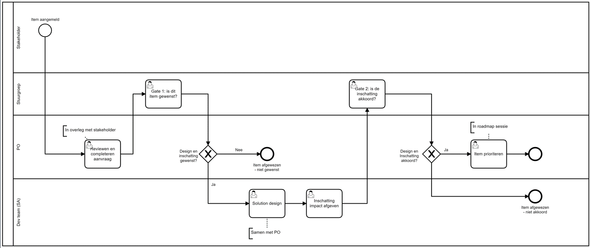

# Sturing

**Stuurgroep**

Voor de GZAC-editie bestaat een stuurgroep, bestaande uit afgevaardigden van partijen die financieel bijdragen aan de open source ontwikkeling. De groep bepaalt de ontwikkelrichting. Er zijn circa 16 online bijeenkomsten per jaar, en vier keer per jaar wordt een fysieke bijeenkomst georganiseerd.

**Sprint reviews**

Eens per twee weken wordt het resultaat van een sprint getoond in een openbare, online sprint review. De opnames daarvan worden online gedeeld en zijn voor iedereen openbaar.

**Prioritering wensen (user stories)**

Wensen kunnen worden ingebracht in de vorm van een issue op Github: https://github.com/generiekzaakafhandelcomponent/gzac-issues/issues. Vervolgens kan de indiener kiezen het issue zelf te bouwen. In dat geval wordt [deze](https://docs.valtimo.nl/contributing-to-valtimo/contributing-to-valtimo) procedure gevolgd. Het productteam verwerkt ook elke sprint issues. De Product Owner prioriteert. Hierbij spelen onder andere de volgende factoren een rol:

* Past de feature in de productvisie
* Past de feature in een thema dat met de stuurgroep is afgesproken
* Heeft de feature een zwaarwegend belang voor de organisatie, bijvoorbeeld als afhankelijkheid voor de implementatie van een proces
* Zijn er meerdere organisaties die deze feature ook belangrijk vinden. Daarbij is een van de maatstaven het aantal reacties dat aan een issue wordt gegeven:

<figure><figcaption></figcaption></figure>

**Grotere uitbreidingen (Epics)**

De product roadmap wordt bepaald door de stuurgroep. Elke deelnemer kan roadmap items inbrengen. Elk nieuw roadmap item wordt opgebouwd in de volgende structuur:

* Doel
* Context / achtergrond
* Wat moet er gebeuren - wat is er nog niet en hebben we wel nodig?
* Wat is het eindresultaat?
* Wat valt er buiten scope?

Tweewekelijks op donderdag worden nieuwe ingebrachte roadmap items besproken. Uiterlijk maandag voorafgaande dienen nieuwe items te zijn aangebracht bij de PO, zodat ze tijdig kunnen worden gedeeld met de leden van de stuurgroep en hen de kans te geven de ze inhoudelijk te beoordelen.\
\
Vervolgens wordt het volgende proces wordt doorlopen:

<figure><figcaption></figcaption></figure>

Indien de stuurgroep een nieuw aangebracht roadmap item een goed toevoeging op het product vindt, wordt het voorgelegd aan het ontwikkelteam voor de technische uitwerking. Dit proces neemt minimaal 1 en soms 2 sprints in beslag, afhankelijk van de complexiteit en het aantal betrokken (technische) stakeholders. De uitkomst is een technische uitwerking - soms in meerdere varianten van kwaliteit en omvang, met daarbij een schatting van de inspanning in manweken.\
\
Op basis van deze schatting en het technisch advies besluit de stuurgroep óf ze het roadmap item daadwerkelijk wil laten bouwen, in welke variant en wanneer.
